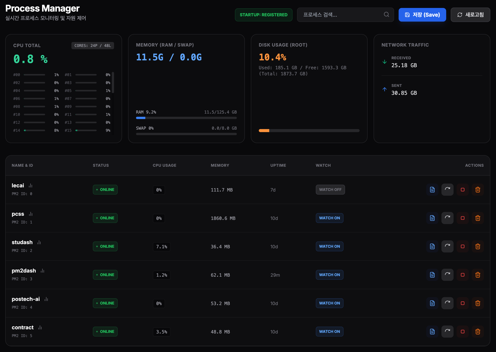

# PM2Dash

FastAPI 기반의 실시간 PM2 프로세스 모니터링 및 관리 대시보드입니다. 웹 브라우저에서 서버의 프로세스 상태를 한눈에 파악하고 제어할 수 있습니다.

<p align="center">
  
</p>

## 주요 기능
* 실시간 모니터링: CPU 사용량, 메모리 점유율, 업타임 실시간 업데이트
* 프로세스 제어: 웹 UI에서 즉시 Restart, Stop, Delete, Watch 모드 전환 가능
* 실시간 로그 스트리밍: WebSocket을 통한 실시간 프로세스 로그 확인
* 보안 접속: 환경 변수 기반의 관리자 로그인 기능 (ID/PW 세션 인증)
* AI 사용량: 서버의 Claude Code 및 Codex 로컬 세션 기록을 최근 7일 그래프로 집계
* Git 관리: 로컬 저장소 상태, 브랜치, 변경 파일, 커밋 로그 확인 및 Fetch/Pull/Push 실행
* 테마 및 탐색: 화이트/다크 모드와 반응형 사이드바 제공
* Rich 터미널 로그: 실행 정보 패널, 컬러 로그 레벨 및 읽기 쉬운 오류 traceback 제공

## 시작하기

### 1. 가상환경 구축 및 활성화
```bash
uv sync
```

### 2. 환경 변수 설정 (.env)
프로젝트 루트 디렉토리에 .env 파일을 생성하고 로그인 정보를 설정합니다.
```bash
cp .env.example .env
```
**.env 설정 예시:**
```env
ADMIN_USER=admin
ADMIN_PASS=admin1234
SECRET_KEY=your_random_secret_key_here
PORT=8000
HOST=0.0.0.0
LOG_LEVEL=info
APP_ENV=production
```

오류 traceback에 로컬 변수까지 표시하려면 개발 환경에서만 `LOG_TRACEBACK_LOCALS=true`를 설정하세요. 민감한 값이 노출될 수 있으므로 운영 환경에서는 기본값 `false`를 권장합니다.

Claude Code와 Codex가 일반적인 사용자 홈 디렉터리가 아닌 경로에 데이터를 저장한다면 아래 값을 추가할 수 있습니다. 인증 키 자체는 읽지 않으며, 지정된 경로의 로컬 세션 기록만 집계합니다.

```env
CLAUDE_DATA_DIR=/home/user/.claude
CODEX_DATA_DIR=/home/user/.codex

# 선택: Git 저장소를 찾을 상위 폴더. 여러 경로는 OS 경로 구분자(: 또는 ;)로 연결
GIT_REPOSITORY_ROOTS=/home/user

# 선택: 검색 없이 특정 저장소만 노출할 때 사용
GIT_REPOSITORIES=/srv/app-one:/srv/app-two
```

### 3. 대시보드 실행
```bash
python3 run.py
```
실행 후 브라우저에서 http://localhost:8000 접속하여 설정한 계정으로 로그인합니다.

## 프로젝트 구조
```text
PM2Dash/
├── app/
│   ├── routes/          # 페이지 라우팅 (pm2_routes.py, auth_routes.py)
│   ├── services/        # 비즈니스 로직 (pm2_service.py, auth_service.py)
│   ├── templates/       # HTML 템플릿 (process.html, login.html)
│   └── main.py          # FastAPI 앱 및 세션 미들웨어 설정
├── venv/                # 파이썬 가상환경
├── .env                 # 환경 변수 (인증 및 보안 설정)
├── README.md            # 프로젝트 문서
├── requirements.txt     # 설치 필요 패키지 목록
└── run.py               # 서버 실행 엔트리포인트
```

---
